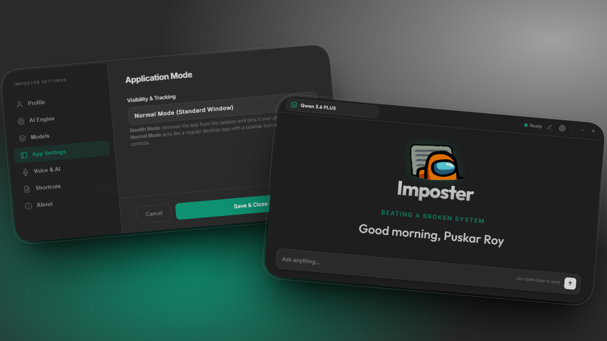

# Imposter: Beating a Broken System

<div align="center">
  
  <h3>An undetectable multi-LLM companion. Designed for your most critical live calls and assessments.</h3>
  <p><strong>Official Website: <a href="https://www.tryimposter.site">tryimposter.site</a></strong></p>
  <br>
  
</div>

---

## Key Capabilities

Imposter provides a discreet, always-on-top AI layer designed for maximum invisibility.

*   **Stealth Window**: Hardware-level DRM protection (Windows/macOS) and KWin Scripting (Linux KDE) makes the AI invisible to screen-sharing, screenshots, and meeting platforms (Zoom, Teams).
*   **Voice Transcription**: Real-time system audio capture streamed to AssemblyAI for live results.
*   **Screen OCR**: Local Tesseract.js extraction from any region-snip directly into your AI prompt.
*   **High-Stakes Personas**: 12 context-aware identities tailored for specific assessment scenarios.
*   **Multi-Provider AI**: Connect to the world's most powerful models through a unified interface.
    *   **Google Gemini**: High-performance reasoning via Google AI Studio.
    *   **OpenRouter**: Access to hundreds of cloud models (Claude, GPT, Llama) with a single key.
    *   **Ollama**: Complete privacy with local models running on your own hardware. Zero internet required.
    > **[View Detailed Provider Setup Guide →](https://www.tryimposter.site/model-providers)**

---

## Official Resources

*   **[Full Features Map](https://www.tryimposter.site/features)** – Deep dive into the stealth toolkit.
*   **[Model Providers](https://www.tryimposter.site/model-providers)** – Setup guides for **Gemini**, **OpenRouter**, and **Ollama**.
*   **[Architecture Guide](https://www.tryimposter.site/architecture)** – Technical breakdown of the stealth bridge.
*   **[Upcoming Roadmap](https://www.tryimposter.site/upcoming)** – The Chameleon Switch & Double-Display.

---

## The Stealth Advantage

Built on a specialized architecture, Imposter remains non-intrusive and computationally isolated until triggered.

*   **Hardware DRM**: Blocks all standard capture APIs on Windows and macOS.
*   **KDE Plasma Stealth**: Native compositor integration via KWin scripting for true invisibility on Linux (KDE 6.6+).
*   **Disguised UI**: Instantly transform into a standard utility identity to stay under the radar.
*   **100% Local**: Zero telemetry. Prompts, conversations, and keys never leave your machine.

---

## Technical Architecture

Imposter leverages a secure, multi-process environment:
*   **Main Process**: High-privilege Node.js managing windows and OS-level primitives.
*   **Renderer Processes**: Isolated Chromium instances for the Stealth UI and Snipper tools.
*   **Stealth Bridge**: Secure IPC with Context Isolation for safe OS bridging.

> **[Read Full Architecture Docs on the Web →](https://www.tryimposter.site/architecture)**

---

## Quick Start

### 1. Installation
```bash
git clone https://github.com/Puskar-Roy/Imposter.git
npm install
```

### 2. Configuration
Copy `.env.example` to `.env` and add your **Gemini** or **OpenRouter** keys.
> **[Need help with API keys? Visit our Provider Guide →](https://www.tryimposter.site/model-providers)**

### 3. Execution
```bash
npm start
```

---

## Community & Security

*   **Contributing**: Check out our **[Contributing Guide](CONTRIBUTING.md)**.
*   **Security**: Report vulnerabilities via our **[Security Policy](SECURITY.md)**.

Developed by **[Puskar Roy](https://github.com/Puskar-Roy)**.
Stay Invisible. Stay Ahead.
